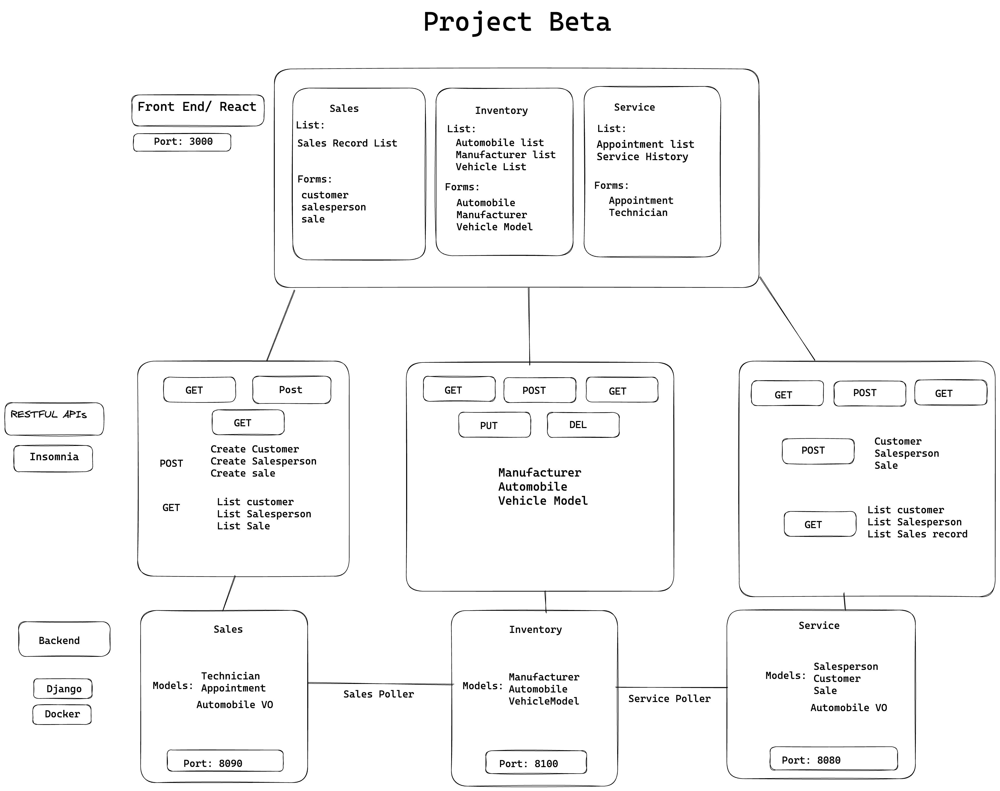

# CarCar


Team:

* Person 1 - Which microservice?
* Person 2 - Which microservice? Diana - Service

## Instructions to Get Started

<p>Clone the repository project at:
https://gitlab.com/sjp19-public-resources/sjp-2022-april/project-beta <br>
*Type this in your terminal to run docker <br>
docker volume create beta-data <br>
 docker-compose build <br>
 docker-compose up <br>

*Confirm that all  containers are running <br>
Run the application at: http://localhost:3000/ <br>

## Design


## Microservice Ports
Front-end application: http://localhost:3000/ <br>
Inventory API: http://localhost:8100/ <br>
Service API: http://localhost:8080/ <br>
Sales API: http://localhost:8090/ <br>

## Sales microservice


## Service microservice

The Service microservice retrieves car data from the Inventory microservice and creates value objects for managing car data through the Service API. Users can create service appointments, technicians, view appointments, cancel or mark them as finished, and delete technicians.

## RestFul API (Port 8080):


# Technicians API

This API provides endpoints to manage technicians in a system.

## Endpoints

| Action              | Method | URL                                          |
|---------------------|--------|----------------------------------------------|
| List Technicians    | GET    | http://localhost:8080/api/technicians/       |
| Create a Technician | POST   | http://localhost:8080/api/technicians/       |
| Show Technician Details | GET | http://localhost:8080/api/technicians/:id |

### List Technicians

Retrieves a list of all technicians.

* Method: `GET`
* Response: A list of all technicians in the system. The exact format of the response will depend on the implementation of the API.

### Create a Technician

Adds a new technician to the system.

* Method: `POST`
* Request Body: A JSON object containing the details of the new technician.
* Response: The details of the newly created technician in a JSON object.

### Show Technician Details

Retrieves the details of a specific technician.

* Method: `GET`
* URL Parameters:
  * `id`: The ID of the technician to retrieve.
* Response: The details of the specified technician in a JSON object.

### Create Technicians Input
```
{
	"name": "Tim",
	"employee_number": 200
}
```

### Get Technician Output
```
{
	"technician": {
		"name": "Bob",
		"employee_number": 2,
		"id": 2
	}
}
```


# Appointments API

This API provides endpoints to manage appointments in a system.

## Endpoints

| Action                  | Method | URL                                          |
|-------------------------|--------|----------------------------------------------|
| List All Appointments   | GET    | http://localhost:8080/api/appointments/     |

### List All Appointments

Retrieves a list of all appointments.

* Method: `GET`
* Response: A list of all appointments in the system.
